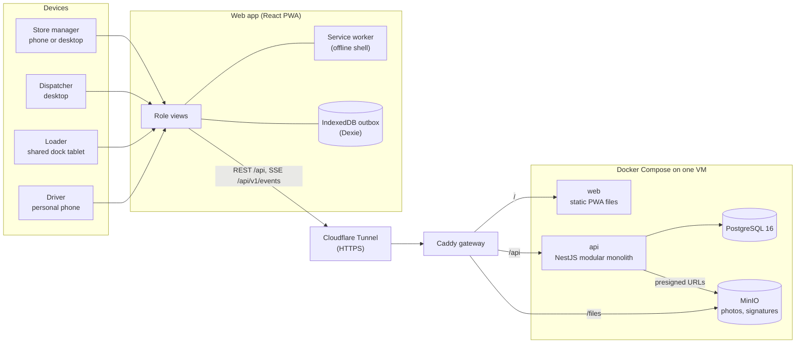

# Architecture

> Draft (26 Sep): written from the agreed design and team decisions. Update it after the build to match what was actually shipped, then remove this note.

Waypoint Relay is one responsive web app (an installable PWA) for four roles, backed by one NestJS service and one PostgreSQL database. Everything runs with a single `docker compose up`.

## System diagram

`packages/shared` (Zod schemas and the constraint validator) is imported by both the web app and the API, so the dispatcher sees rule violations instantly and the server enforces the same rules.

## Components

| Component | Responsibility |
|---|---|
| **web** (`apps/web`) | React + Vite + TypeScript PWA. Phone layout for driver, loader and store manager; large-screen layout for the dispatcher and the store manager's counter. Installs to the home screen and works offline |
| **api** (`apps/api`) | NestJS modules: auth, master-data, orders, planning, loading, delivery, sync, receiving, live, events. REST with Swagger at `/api/docs`, SSE for live updates, `/health` for checks |
| **shared** (`packages/shared`) | Zod schemas, the 7 feasibility rules, trip-time and fuel calculations |
| **engine** (`packages/engine`) | Allocation: HiGHS optimiser with a greedy fallback, and the swap suggestion for deferred orders |
| **db** | PostgreSQL 16; schema and migrations by Prisma; seeded on first start |
| **minio** | S3-compatible storage for proof-of-delivery photos, signatures and issue photos |
| **seed** | Loads the shared datasets and one realistic peak day (S1), idempotently |
| **gateway** | Caddy routes `/`, `/api` and `/files` |

## Key flows

### Planning (dispatcher)
1. At 16:00 a scheduled job confirms the day's orders.
2. Auto-plan runs the engine; the validator checks every trip (capacity, reefer, van-only, depot, brand and district, time budgets, fuel).
3. For each deferred order the dispatcher sees its skip history and a suggested swap with its consequences.
4. **Publish** saves trips, stops, deferrals, order statuses and events in **one transaction**, then SSE notifies loaders and store managers.

### Offline delivery (driver)
1. The driver's run is cached on the phone.
2. Every action (arrival, delivery, problem) is written to the IndexedDB outbox with a client UUID and the phone's time. Photos are compressed on the phone.
3. When the connection returns, the outbox is sent to `POST /api/v1/sync/batch`. The batch is one transaction and each record is inserted once (`ON CONFLICT (client_uuid) DO NOTHING`), so retries never double-count.
4. If the plan changed while the driver was offline, the driver's record is kept and the dispatcher gets a `sync_conflict` issue.
5. A driver with no contact during a departed trip shows as **Offline** with the last contact time, not as Late.

### Proof of delivery files
The app asks the API for a presigned URL, uploads the photo straight to MinIO, then sends the delivery record with the file key. A delivery counts as complete only after its photo is stored.

## Decisions

| Decision | Why |
|---|---|
| **One PWA, not native apps** | The booklet requires a responsive web app and judges it on phone-sized screens; a PWA installs, works offline and uses the camera |
| **Modular monolith, not microservices** | Publishing a plan changes orders, trips, stops and deferrals together, which is one database transaction in a single service. About 120 outlets and 60 vehicles need no more than one service |
| **PostgreSQL, not a document DB** | The data is relational (depot → district → outlet → order → stop → trip → vehicle) and needs foreign keys, checks and transactions |
| **One shared validator** | The same rules run in the browser and on the server; no rules in SQL triggers, so they can't drift apart |
| **HiGHS with a greedy fallback** | An optimiser finds a good plan in seconds; the greedy plan guarantees an answer if the optimiser fails |
| **SSE, not WebSockets** | Updates only flow from server to clients |
| **No Redis or job queue** | One API instance; scheduled jobs use `@nestjs/schedule`, events use the in-process event emitter |
| **MinIO behind a storage interface** | Same API as S3; can be swapped for a Docker volume or AWS S3 with a config change |
| **No LLM or external AI services** | The competition data must not be sent to third parties; planning must be deterministic |

## Deployment

| Part | Choice |
|---|---|
| Host | One Google Cloud VM running the same `docker-compose.yml` as local, plus `docker-compose.prod.yml` |
| Public access | Cloudflare Tunnel (no open ports on the VM) |
| Caching | Static files cached at Cloudflare; `index.html`, `sw.js` and the manifest are not cached, so PWA updates reach users |
| Live updates | SSE with a 30-second heartbeat so idle connections stay open |
| CI | On every pull request: lint, typecheck, unit tests, `docker compose up` smoke test, health check, and the official `check_allocation.py` on the seeded plan |
| CD | On a `v*` tag on `main`: pull and restart on the VM, then a public health check |

## Security

- JWT sign-in for dispatcher, driver and store manager; loaders use a 4-digit PIN on the shared depot tablet, so every load check records who counted.
- Every endpoint checks the role **and** the scope: a store manager sees only their outlet, a driver only their trips, a loader and dispatcher only their depot.
- Secrets live in `.env` (not committed); `.env.example` lists the variables.

## If it had to scale

The modules are separated, so `sync` or `planning` could move into their own services. With several API instances we would add Redis for pub/sub between instances and a job queue for long allocations.
