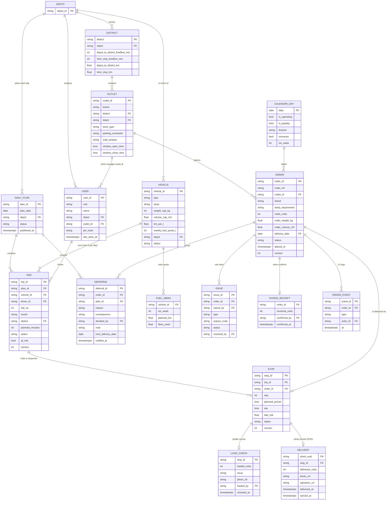

# Data Model

> Draft (26 Sep): written from the finalised ER diagram and the Figma design. Fields marked (+) were added for the screens and still need team confirmation. Update this file if the Prisma schema changes, then remove this note.

PostgreSQL 16, managed with Prisma migrations. All times are `timestamptz` in Asia/Colombo. Full field lists and rules: [backend-spec.md](backend-spec.md).

## ER diagram



`SERVICE_ALLOWANCE` (brand + dock_type → minutes) and the cases-to-kg/m³ table are seeded lookups with no relationships, so they are not drawn.

## Entities

| Entity | What it holds | Source |
|---|---|---|
| DEPOT | Peliyagoda and Kandy | seed |
| DISTRICT | 12 districts with travel times and distances from the depot | `district_travel.csv` |
| OUTLET | 120 Waypoint stores: brand, access, windows | `outlets.csv` |
| VEHICLE | 60 trucks and vans: reefer or ambient, limits, fuel | `vehicles.csv` |
| USER | Dispatcher, loader, driver, store manager | seed (4 roles) |
| CALENDAR_DAY | Operating days, paydays, festivals, monsoon | `calendar.csv` |
| ORDER | One store order for a date, chilled or ambient, in cases, kg and m³ | app (store manager) + S1 seed |
| DAILY_PLAN | One depot's plan for one day, draft or published | app (dispatcher) |
| TRIP | One vehicle run: one brand, one district, trip 1 or 2 | app (engine) |
| STOP | One order on a trip, in visit order, with ETA and late risk | app (engine) |
| DEFERRAL | An order moved to a later run, with the reason and consequence | app (engine, dispatcher) |
| FUEL_WEEK | A vehicle's planned fuel for a week, against its quota | app (engine) |
| LOAD_CHECK | Loader's count before departure, and any shortfall | app (loader) |
| DELIVERY | Driver's proof of delivery; can be recorded offline | app (driver) |
| GOODS_RECEIPT | Store's confirmed count | app (store manager) |
| ISSUE | A reported problem: shortfall, damage, mismatch, lateness, delivery problem, sync conflict | app (all roles) |
| ORDER_EVENT (+) | Append-only log of every status change; feeds notifications, history and the live timeline | app |

**Three counts, one order:** LOAD_CHECK (loader) → DELIVERY (driver) → GOODS_RECEIPT (store). Where the number drops is where the goods went missing.

## Value sets

| Field | Values |
|---|---|
| OUTLET.brand | Fresh, Style, Tech |
| OUTLET.dock_type | rear_dock, street, mall_bay |
| OUTLET.parking_constraint | normal, van_only, mall_dock |
| VEHICLE.type / temp | truck, van / reefer, ambient |
| VEHICLE.status | available, in_workshop |
| USER.role | dispatcher, loader, driver, store_manager |
| ORDER.temp_requirement | chilled, ambient |
| ORDER.status | Placed, Confirmed, Planned, Deferred, Loaded, OnTheWay, Delivered, Received, Disputed |
| DAILY_PLAN.status | draft, published |
| TRIP.status | planned, loading, ready, departed, completed |
| STOP.status | pending, arrived, delivered, problem |
| DEFERRAL.reason | reefer_full, larger_than_any_vehicle, van_only_no_van, no_time |
| LOAD_CHECK.issue | none, missing, damaged, wrong_item, too_warm |
| ISSUE.type | shortfall, damage, discrepancy, late, delivery_problem, sync_conflict |
| ISSUE.status | open, resolved |

## Constraints

```
UNIQUE  delivery.client_uuid                  -- a retried offline sync is saved once
UNIQUE  stop.order_id                         -- an order sits on one stop only
UNIQUE  load_check.stop_id
UNIQUE  trip (vehicle_id, plan_id, trip_no)
CHECK   trip.trip_no IN (1, 2)                -- max 2 trips per vehicle per day
CHECK   order_units > 0 AND order_weight_kg > 0 AND order_volume_m3 > 0
```

Routing rules (capacity, reefer, van-only, one brand and district per trip, time budgets, fuel) are checked by the shared validator, not by the database, because the same code also runs in the dispatcher's browser.

## Indexes

| Query | Index |
|---|---|
| A store's orders for a date | `order (outlet_id, delivery_date)` |
| Confirmed orders to plan | `order (delivery_date, status)` |
| A trip's stops in order | `stop (trip_id, seq)` |
| A vehicle's trips | `trip (vehicle_id, plan_id)` |
| "Skipped before?" history | `deferral (order_id)` |

## Concurrency and offline records

- **Idempotent sync:** every driver record carries a `client_uuid` made on the phone; the server inserts with `ON CONFLICT (client_uuid) DO NOTHING`.
- **Two times:** `delivered_at` is the time on the phone, `synced_at` is when the server received it.
- **Optimistic locking:** ORDER, TRIP and STOP have a `version` column. A driver's offline record that meets a plan change is kept (what happened on the ground wins) and raises a `sync_conflict` issue for the dispatcher.

## Not modelled, and why

| Item | Reason |
|---|---|
| Order lines (items, SKUs) | The shared data has no item-level detail; an order is total cases, kg and m³ |
| FORECAST | In the ER, but no screen uses it; forecasting is the Datathon's Task 2A |
| Notifications table | Built from ORDER_EVENT |
| Prices, invoices, payments | Outlets are Waypoint's own stores; deliveries are internal stock transfers |
| GPS tracks | No outlet coordinates in the data; the design uses a progress timeline |
